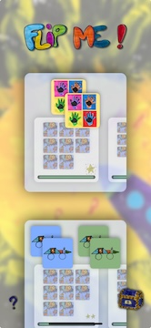
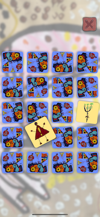
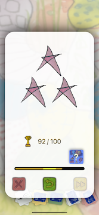
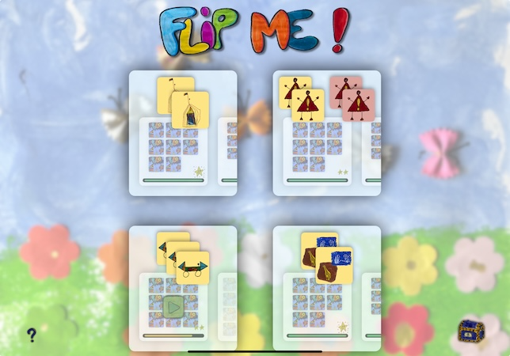

# FlipMe-OpenSourcePart ([Product page](https://mousquetaire-softwares.github.io/FlipMe/))

Flip Me: Concentration game (AppStore iOS) - then open-source part of the code.

This project contains a truncated version of the original **FlipMe** iOS game available on the App Store. It showcases core concepts and techniques, including MVVM architecture, design principles, and unit testing.

Only a few images from the original game are included, but only two blocks of code have been removed : the scoring algorithm, and the gesture handling for flipping cards (live 3d flipping effect).

## 🕹️ Game Overview

**FlipMe** is an engaging and challenging memory game where users flip tiles to match pairs. The game increases in difficulty with each level, and gives rewards with new images and game modes.

### Screenshots (version 1.1.0)

🔗 **Download the game on the App Store**: [FlipMe on the App Store](https://apps.apple.com/us/app/flip-me-concentration-game/id6499492638?uo=4))

## 🔨 Project Architecture

This project follows a **Model-View-ViewModel (MVVM)** design pattern, implemented with **UIKit**. Even though UIKit isn't designed with MVVM in mind, this project adopts the pattern to achieve better separation of concerns and minimize the presence of game logic in view controllers.

### Why MVVM?
- The **ViewModel** encapsulates the presentation logic and sometimes the game logic when directly related to to the presentation (**Views**).
- The **Model** layer handles the game logic and business rules not related to the presentation.
- This results in view controllers that are primarily responsible for managing the user interface and interactions.

> **Note:** The separation of the **Model** and **ViewModel** layers in this project goes beyond the classic **MVC** split. The focus is on keeping business logic away from the view controllers as much as possible.

## 📚 Design Principles Applied

This project was developed with a strong emphasis on **clean code** and software design principles. The following principles are implemented throughout the code:

- **Single Responsibility Principle (SRP)**: Each class or struct has a clearly defined purpose, keeping code easy to maintain and extend.
- **Dependency Injection**: External dependencies are injected into classes and structs to enhance testability and flexibility.
- **Interface Segregation Principle (ISP)**: Interfaces are kept small and specific, avoiding large, unwieldy protocols.
- **Open/Closed Principle (OCP)**: Code is designed to be open for extension but closed for modification.

## 🧪 Unit Testing

Unit tests are implemented to cover the key parts of the **Model** and **ViewModel**. The tests ensure the game logic and business rules are functioning as expected. By applying **Dependency Injection**, we were able to mock dependencies and test components in isolation.

### Key Testing Areas:
- Core game mechanics (Model)
- ViewModel logic for presenting game state to the UI
- Edge cases and invalid states handling

## 🚀 Getting Started

### Prerequisites

- Xcode 14.0 or later
- iOS 15.0 or later

## License

This project is open source and available under the MIT License. See the LICENSE file for more info.

## 🙌 Contributions

We welcome contributions to the project! Feel free to fork the repository and submit a pull request with your changes.
